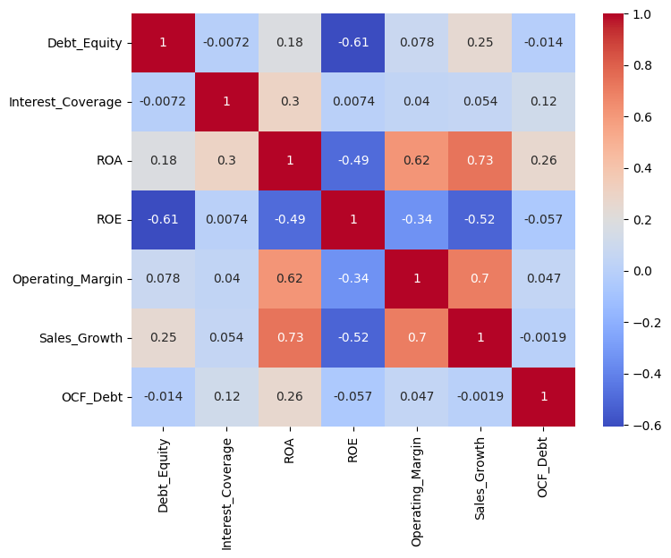
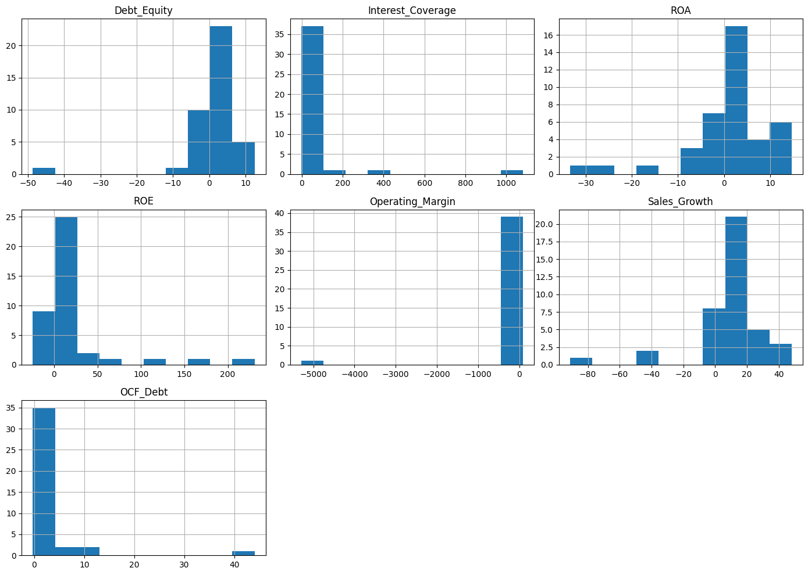
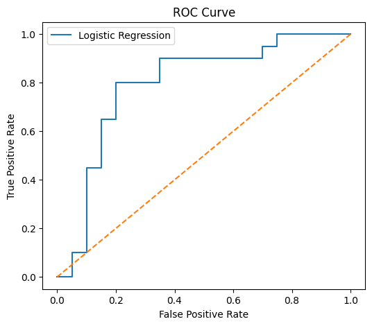
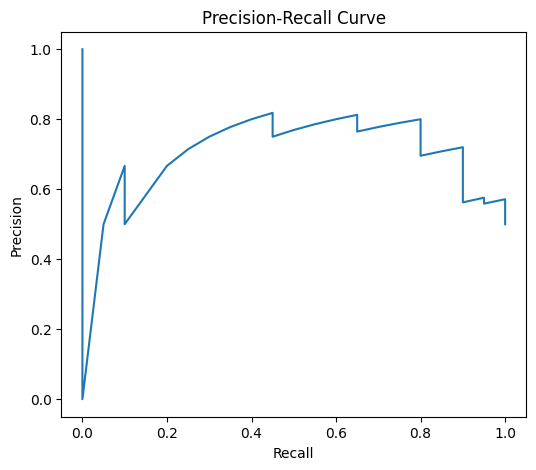
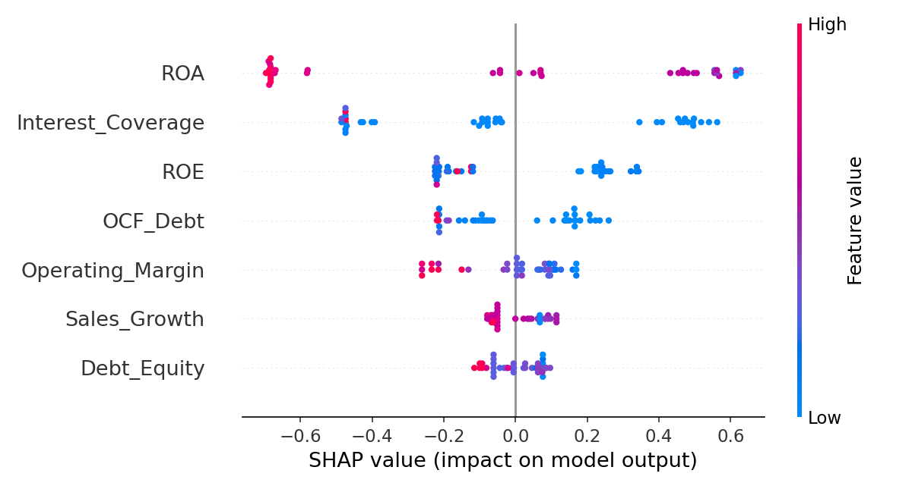
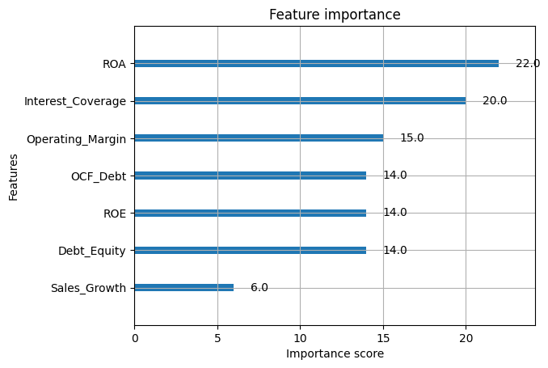

# Corporate Default Prediction — Matched-Pair Credit Risk Model

A machine learning project predicting corporate financial distress in Indian companies using a matched-pair design (20 distressed companies matched to 20 healthy sector peers), 7 financial ratios, and two classifiers (Logistic Regression and XGBoost), explained using SHAP.

## Dataset

- **40 companies** (20 distressed, 20 matched healthy peers), each rated by CRISIL, ICRA, CARE, or India Ratings
- **7 financial ratios per company:** Debt-to-Equity, Interest Coverage, ROA, ROE, Operating Margin, Sales Growth, OCF/Debt
- Distressed companies matched to a same-sector healthy peer around the same financial year, wherever possible

## Exploratory Data Analysis

### Feature correlation



ROA correlates strongly with Operating Margin (0.62) and Sales Growth (0.73), and negatively with ROE (-0.49) — expected, since profitability and efficiency ratios tend to move together.

### Feature distributions



Most ratios are tightly clustered with a few extreme outliers (e.g. Interest Coverage reaching 1000+, Operating Margin dropping below -5000) — driven by companies with near-zero denominators in the ratio calculation.

### Outlier check


Confirms the extreme values seen in the histograms are isolated single-company outliers rather than a systemic data issue. These were verified against source filings rather than removed.

## Model Performance

### ROC Curve Comparison



| Model | ROC-AUC |
|---|---|
| Logistic Regression | 0.85 |
| XGBoost | 0.79 |

Logistic Regression slightly outperforms XGBoost on this small sample (n=40) — consistent with the expectation that simpler models generalize better on limited data.

### Precision-Recall Curve



## Explainability

### SHAP Summary



ROA and Interest Coverage are the two dominant predictors: low ROA (blue, low feature value) pushes predictions strongly toward distress, while high Interest Coverage pushes toward stability.

### Feature Importance (XGBoost Native)



Confirms the SHAP ranking above using XGBoost's built-in importance scoring — ROA and Interest Coverage lead by a clear margin under both methods.

## Key Finding: Misclassification Pattern

All **10 misclassifications (25% of the sample)** were concentrated in companies with **documented, previously-identified data limitations** — not random noise:

**False negatives** (predicted stable, actually distressed): Cox & Kings, Gitanjali Gems, and Talwalkars Better Value Fitness — all three carry analyst-alleged or confirmed accounting irregularities, where manipulated financial statements produced healthy-looking ratios that masked genuine distress. Era Infra Engineering, the one unverified event-date case, was also misclassified.

**False positives** (predicted distressed, actually stable): Thomas Cook India and Bharti Airtel — both matched to distressed peers during periods of genuine sector-wide stress (Cox & Kings' travel-sector downturn, Vodafone Idea's telecom price war), narrowing the real contrast. IndusInd Bank and Can Fin Homes reflect known banking/NBFC ratio-comparability limits. Thangamayil Jewellery and NCC Ltd were both flagged with significant year-mismatches (4+ years) relative to their matched distressed companies.

**No misclassification occurred among the 30 cleanly-matched, fully-verified pairs.** This suggests the model is learning genuine financial-distress signal, and the errors trace back to known data-quality constraints rather than model failure.

## Repository Structure

```
├── README.md
├── data/
│   └── cleaned_corporate_default_prediction.csv
├── images/
│   ├── correlation_heatmap.png
│   ├── df_features_hist.png
│   ├── df_boxplot.png
│   ├── roc_curve_probs.png
│   ├── precision_recall_curve.png
│   ├── shap_summary.png
│   └── feature_importance.png
└── notebook.ipynb
```
